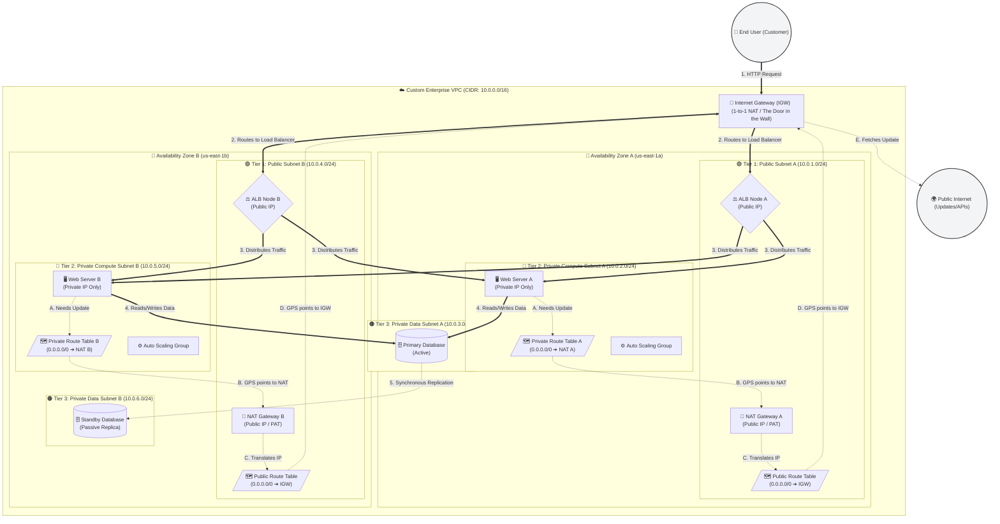

# Project 5: Enterprise-Grade Multi-AZ Architecture (Provisioned via Terraform)

## 🚀 Project Overview
In this project, I architected and deployed a highly available, fault-tolerant enterprise environment on AWS using **Infrastructure as Code (IaC)**. Moving away from manual provisioning, I utilized **Terraform** to declare a 3-tier-ready network across multiple Availability Zones, ensuring that the application can survive the total failure of a data center while maintaining zero-trust security boundaries.

## 📋 Technical Architecture

The architecture follows the **Well-Architected Framework** by separating concerns into distinct layers:
*   **Public Tier:** Hosts the Application Load Balancer (ALB) and NAT Gateways.
*   **Private Tier:** Hosts the Web Server fleet, completely isolated from direct internet access.
*   **Data Tier (Designated):** Pre-configured subnets for future database isolation.

## 🛠️ Technologies & Core Concepts
*   **Terraform (HCL):** Used for declarative infrastructure management, state tracking, and resource lifecycle automation.
*   **High Availability (HA):** Deployed across `us-east-1a` and `us-east-1b` to eliminate single points of failure.
*   **Security Group Chaining:** Implemented a "Zero-Trust" model where Web Servers only accept traffic originating from the ALB's specific Security Group.
*   **Elastic Load Balancing (ALB):** Manages traffic distribution and health checks across the server fleet.
*   **Auto Scaling Group (ASG):** Ensures the fleet automatically heals and scales based on demand.
*   **NAT Gateways:** Provides secure, one-way outbound internet access for private instances (for updates/patches) without exposing them to inbound threats.

## 🚀 Implementation Deep-Dive

### 1. Networking Foundation (`network.tf`)
I bypassed the AWS Default VPC to build a custom CIDR-blocked environment. I provisioned:
*   **Internet Gateway (IGW)** for public ingress.
*   **Dual NAT Gateways** (one per AZ) to ensure that even if one zone fails, the other maintains outbound connectivity.
*   **Route Table Logic:** Configured specific routing rules to ensure private traffic is masked behind the NAT Gateways while public traffic is routed to the IGW.

### 2. Security Architecture (`security.tf`)
Instead of using open ports, I implemented **Identity-Based Security Groups**:
*   **ALB Bouncer:** Accepts only HTTP (Port 80) from the public internet.
*   **Web Bouncer:** Rejects all traffic unless it originates from the ALB Bouncer's ID, preventing "Side-Channel" attacks.

### 3. Compute & Scaling (`compute.tf`)
I utilized **Launch Templates** to define the server's "DNA" (Amazon Linux 2023, Apache, and automated bootstrap scripts). The **Auto Scaling Group** was then configured to maintain a minimum of 2 instances across different zones, providing 99.99% availability.

## 🧠 Strategic Challenges & Solutions

### Challenge: The "Hidden Dependency" Violation
**The Problem:** During the iterative testing phase, I encountered a `DependencyViolation` when attempting to destroy the infrastructure. The Security Group refused to delete because the Elastic Network Interface (ENI) from the Fargate/EC2 instances was still detaching.
**The Solution:** I analyzed the resource lifecycle and implemented a strategic wait-state in the automation logic, ensuring that network interfaces are fully released before the security layer is dismantled.

### Challenge: State Consistency in Local Environments
**The Problem:** Managing infrastructure from a local VPS introduced risks of state drift.
**The Solution:** I mastered the use of `terraform plan` to perform dry-run inspections before every deployment, ensuring that the "Desired State" in my code perfectly matched the "Actual State" in AWS.

## 📈 Business Impact
By migrating to this Terraform-based architecture, a business reduces its **Recovery Time Objective (RTO)** to near zero. The automated nature of the deployment eliminates human error, reduces configuration drift, and allows for the entire global infrastructure to be replicated in minutes rather than days.

---

